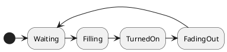
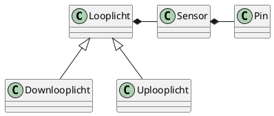

# traplicht
This project was created by me and tested on the great site wokwi.

See that project at https://wokwi.com/arduino/projects/310166207811551808; simulate this project if you do not have an arduino nano

# What this does:
Based on a PIR sensor at the bottom of the stair, and another at the top, 
the led strip will light up along with you as you walk up or down the stairs.
After a waiting period, the light goes off again.

A guard has been added that prevents triggering the top sensor if you just have 
walked to the top, or the bottom sensor vice versa. 

If you happen to be faster than the light, then this results in a 'party mode'

# How it works

Basically the Looplicht class is responsible for generating the random color at 
begin and increasing to the end, waiting, and then clearing the random color.
It is subclassed to redefine top as begin and bottom as end or vice versa.  
It contains a simple state machine that is always followed in sequence

The Sensor class is responsible for sending a single trigger if it is armed and detects
movement. The sensor I used is the HC-SR505 which does not have any means of
setting the trigger time, so this was wrapped in a class that creates the single
trigger.

Finally in the traplicht.ino two digital in pins are bound to two instances of 
sensor. Each Sensor is then coupled to a subclassed Looplicht, and in the loop
function the addition is done for all sensors.

