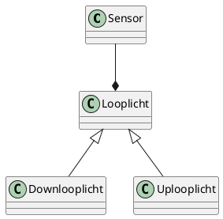

# traplicht
This project was created by me and tested on the great site wokwi.

See that project at https://wokwi.com/arduino/projects/310166207811551808; simulate this project if you do not have an arduino nano

# What this does:
Based on a PIR sensor at the bottom of the stair, and another at the top, 
the led strip will light up along with you as you walk up or down the stairs.
After a waiting period, the light goes off again.

A guard has been added that prevents triggering the top sensor if you just have 
walked to the top, or the bottom sensor vice versa. 

If you happen to be faster than the light, then this results in a 'party mode'

# How it works

